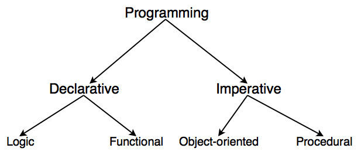

- Todo 1 : 명령형 코드를 선언적 코드로 바꾸어보아라
  

# 프로그래밍 패러다임

선언적 프로그래밍이라는 넓은 프로그래밍 패러다임 안에 함수형 프로그래밍이 있다.

# 명령형 프로그래밍
  - How, 어떤 방법으로 프로그래밍 할 것인지에 중점을 둠.
 예시를 보면 #무엇을 할지 세세하게 지정한다.

function order(arr, divisor) {
    const answer = [];

    for (const index in arr) {
        if (arr[index] % divisor === 0) {
            answer.push(arr[index]);
        }
    }

    return answer.length === 0 ? [-1] : answer.sort((a, b) => a - b);
}

-- 절차지향과 객체지향은 서로 반대가 아니다!--

### 절차지향 프로그래밍 -- 데이터 중심

 - 순차적인 처리가 중요시 되며 프로그램 전체가 유기적으로 연결되도록 만드는 프로그래밍 기법. 개발하려는 것을 기능별로 묶어 모듈화를 함으로써 같은 기능을 중복으로 연산하지 않거나 모듈을 재활용 하여 유지보수에 편리함

### 객체지향 프로그래밍 -- 기능 중심

- 실제 세계를 모델링 하여 소프트웨어를 개발하는 방법. 데이터와 절차를 하나의 덩어리로 묶어서 생각하게 됨.
3대 특성
 1. 캡슐화 - 데이터를 감추고 외부 세계와의 상호작용은 메소드를 통하는 방법
 2. 상속 - 클래스를 이어받아 새로운 클래스를 생성하는 기법(코드의 재사용)
 3. 다형성 - 하나의 이름으로 많은 상황에 대처하는 기법

# 선언형 프로그래밍
선언형 프로그래밍은 무엇인가를 작업하기 위한 방법을 정의하는 것을 의미한다. 제어흐름을 설명하지 않고 계산 논리에 집중하는 프로그래밍 패러다임이다.
 - 선언형 프로그래밍은 목표를 명시하고 알고리즘을 명시하지 않는다(숨긴다)

### 결과를 기술할 뿐 어떻게는 기술하지 않는 프로그래밍 방법 의도에 집중한 프로그래밍 방법

 1. 함수형 프로그래밍
  - 변경 가능한 상태를 불변상태로 만들어 sideEffect를 없앤다

`
function solution(arr, divisor) {
    const answer = arr.filter((num) => num % divisor === 0);
    return answer.length === 0 ? [-1] : answer.sort((a, b) => a - b);
}
`

 - 모든 것은 Object(객체)이다.
 - 함수형 언어에서는 class외에 함수 또한 객체이다. (value-값)처럼 쓰일 수 있다.

  ### ex1  
  * 명령형 
  
  `
    
    const  x = 5
    
    const xSquared = x * x;

    let isEven ;

    if( xSquared % 2 ===0){
        isEven = true;
    } else {
        isEven = false;
    }
  ` 

 * 선언형 

  `
    
    const isSquareEven = (x) => ((x * x) %2 ===0 ? true: false)

    isSquareEven(5)

  `

- Todo2 : map함수를 reduce로 바꾸어보아라

 # map

`
    
    let numbers = [1, 2, 3, 4, 5]

    var result_ = numbers.map(Math.sqrt)
    
    console.log(result_)
`

`

# reduce
`
    
    const numbers_2 = [1, 2, 3, 4, 5]
    const result_2 = numbers_2.reduce((acc, cur) => {
    acc.push(Math.sqrt(cur));
    return acc
    }, [])
    console.log(result_2);

`

**reduce 콜백 사용**

